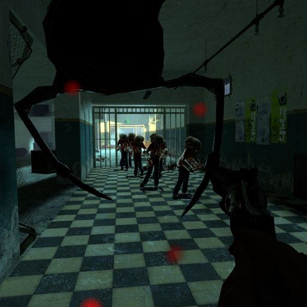

  
  </a>
  

# Zombie Invasion Mod
> Garry's Mod Workshop Addon.

This addon will constantly spawn random NPC within a certain distance of any player.
I made this because I couldnt find any addons/gamemodes that did this without manually placing NPC spawners everywhere which is stupid.

Not only zombies can be spawned, but any class that works normally in the game, what spawns can all be changed via the 'Spawn Editor' in the Q menu options.

## Usage example

You can change all of the settings via the spawn menu (Q) under options on the right side.

To enable the console, go options>keyboard>advanced>enable developer console, then press ¬, the button above tab. Then type some of the commands below:

* zinv 1/0 - On/Off.
* zinv_maxdist 0-9999 - NPCs wont spawn further than this.
* zinv_mindist 0-9999 - NPCs will only spawn after this distance from a player.

Types of NPC that spawn and information about them can be changed via spawn menu>options>zinv>settings>spawn editor

## FAQs

* Nothing is spawning, why?
    * Only maps with info_nodes will work, it might be the map you are playing on doesn't have them. Another option is a conflict with other mods, try disabling all of them first and enable this one to test.
* What does the min dist and max dist mean?
    * This feature will keep the NPCs local to the online players. They wont spawn closer than the minimum distance and wont spawn outside the maximum distance away from any player. Additionally, if the NPC is detected outside the max distance range, it will be deleted.
* I have a good idea for a feature.
    * Please post on our gihub page as an issue.
* I have removed this mod but the NPCs keep spawning.
    * Make sure you close your game after unsubscribing, also there is a duplicate mod on the workshop, make sure that is also removed.

## Meta

Distributed under the XYZ license. See ``LICENSE`` for more information.

[https://github.com/supersonic1999](https://github.com/supersonic1999/)

## Contributing

1. Fork it (<https://github.com/yourname/yourproject/fork>)
2. Create your feature branch (`git checkout -b feature/fooBar`)
3. Commit your changes (`git commit -am 'Add some fooBar'`)
4. Push to the branch (`git push origin feature/fooBar`)
5. Create a new Pull Request
